# sys_G 参数手册 — 合成畴区图像生成器

> 本文档详尽说明 HexagonGenerator 和 MicroscopyAugment 的每一个可调参数，
> 包括参数含义、取值范围、视觉效果及调参建议。
>
> **基准配置与 `gen_multi_mag.py` 的 `SHARED_GEN_KWARGS` 完全一致**，
> `color_std` 固定为 `0.2`。
> 所有对比图均采用**控制变量法**生成（固定随机种子 `seed=42`，仅改变目标参数）。

---

## 目录

1. [系统架构概述](#1-系统架构概述)
2. [多倍率视场与畴区密度总览](#2-多倍率视场与畴区密度总览)
3. [生成器参数 — HexagonGenerator](#3-生成器参数--hexagongenerator)
   - [3.1 颜色与纹理](#31-颜色与纹理)
   - [3.2 几何与尺寸](#32-几何与尺寸)
   - [3.3 边缘毛刺](#33-边缘毛刺)
   - [3.4 重叠控制](#34-重叠控制)
   - [3.5 渲染](#35-渲染)
4. [增强器参数 — MicroscopyAugment](#4-增强器参数--microscopyaugment)
5. [参数交互关系](#5-参数交互关系)
6. [调参工作流建议](#6-调参工作流建议)
7. [运行展示脚本](#7-运行展示脚本)

---

## 1. 系统架构概述

```
HexagonGenerator.generate(image_size)     ← 生成畴区图像 + 多边形标注
       ↓
MicroscopyAugment(img)                    ← 模拟显微镜成像效果
       ↓
refine_polygons() + ISATSaver.save()      ← 裁剪越界多边形 + 保存标注
```

- **HexagonGenerator**: 在带噪背景上随机放置带纹理扰动的六边形畴区，通过 OverlapController 控制重叠
- **MicroscopyAugment**: 对生成图像施加亮度、对比度、Gamma、模糊、噪声、色温偏移等增强
- **所有随机性可控**: 通过 `random.seed()` / `np.random.seed()` 可实现完全复现

---

## 2. 多倍率视场与畴区密度总览

`gen_multi_mag.py` 的核心设计：通过单一 `mag_factor` 参数同时控制畴区大小和密度，
模拟不同显微镜放大倍率下的视场效果：

```
有效半径 = base_r × mag_factor × image_scale × supersample_ratio
有效数量 = base_num / mag_factor²
```

### 倍率映射表

| 倍率标签 | mag_factor | 有效半径 (px) | 有效数量 | 效果描述 |
|----------|------------|---------------|----------|----------|
| **2.5x** | 0.25 | 7–12 | 3200–6400 | 远景：畴区极小、极高密度 |
| **5x** | 0.5 | 15–25 | 800–1600 | 中远景：畴区小、高密度 |
| **10x** | 1.0 | 30–50 | 200–400 | 参考倍率（baseline） |
| **20x** | 2.0 | 60–100 | 50–100 | 近景：畴区大、中等密度 |
| **50x** | 5.0 | 150–250 | 8–16 | 高倍：畴区很大、稀疏 |
| **100x** | 10.0 | 300–500 | 2–4 | 特写：仅个别大畴区 |

> 计算基准: `base_r_range=(15,25)`, `base_num_range=(200,400)`, `image_scale=2`, `supersample_ratio=1`

### 多倍率总览图

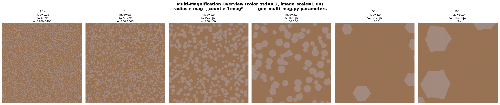

> **图释**: 从 2.5x 到 100x，同一套基准参数仅通过 `mag_factor` 产生完全不同的视场效果。
> 低倍率下畴区小而密集（适合统计分布分析），高倍率下畴区大而清晰（适合形态学分析）。

---

## 3. 生成器参数 — HexagonGenerator

### 参数总览

| 分组 | 参数 | 类型 | 默认值 | 含义 |
|------|------|------|--------|------|
| 颜色/纹理 | `color_mean` | tuple | `(163,138,127)` | 畴区 RGB 均值 |
| | `bg_mean` | tuple | `(153,115,85)` | 背景 RGB 均值 |
| | `color_std` | float | **0.2** | 畴区间颜色差异 |
| | `texture_std` | float | `2` | 畴区内部纹理噪声 |
| | `bg_noise_std` | float | `2` | 背景像素噪声 |
| 几何/尺寸 | `base_r_range` | tuple | `(15,25)` | 基础半径范围 |
| | `base_num_range` | tuple | `(200,400)` | 基础数量范围 |
| | `size_std` | float/None | `25` | 大小分布标准差 |
| | `mag_factor` | float | `1.0` | 缩放倍率 |
| | `shape_jitter` | float | `0.1` | 顶点扰动比例 |
| | `orientation_std` | float | `0` | 畴区取向标准差（度） |
| | `image_scale` | float | `2` | 画布缩放因子 |
| 边缘毛刺 | `edge_burr_amplitude` | float | `0.08` | 毛刺振幅 |
| | `edge_burr_subdivisions` | int | `4` | 边细分点数 |
| 重叠控制 | `max_overlap_ratio` | float | `0.3` | 最大重叠比例 |
| | `max_overlap_count` | int/None | `3` | 最大覆盖层数 |
| | `contain_threshold` | float | `0.85` | 包含判定阈值 |
| | `min_area_factor` | float | `5` | 最小面积因子 |
| 渲染 | `supersample_ratio` | int | `1` | 超采样倍率 |

---

### 3.1 颜色与纹理

#### `color_std` — 畴区间颜色差异 (固定为 0.2)

控制不同畴区之间的颜色差异程度。**在 `gen_multi_mag.py` 中固定为 0.2**，
使得畴区间颜色几乎一致，更接近真实单晶材料的畴区外观。

- **类型**: `float`
- **默认值**: `0.2`
- **典型范围**: `0` (所有畴区同色) ~ `15` (各畴区颜色显著不同)

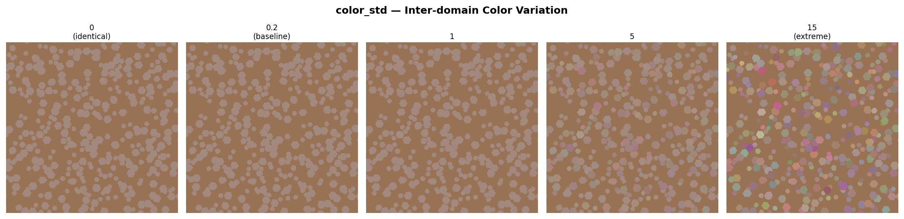

> **说明**: `color_std=0.2` 时畴区间颜色差异极小，肉眼几乎无法分辨色差。
> 增大该值可模拟多晶/多相材料的畴区色差；减小到 0 可获得完全一致的颜色。

---

#### `texture_std` — 畴区内部纹理噪声

每个畴区内部逐像素叠加的高斯纹理噪声强度。值越大畴区表面越粗糙。

- **类型**: `float`
- **默认值**: `2`
- **典型范围**: `0` (完全光滑) ~ `15` (强纹理)

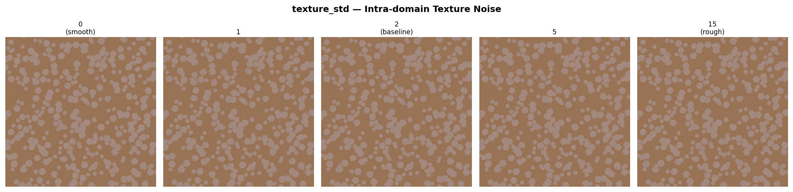

> **建议**: `1~5` 模拟天然晶体畴区的轻微纹理；`0` 用于理想化畴区。

---

#### `bg_noise_std` — 背景噪声

背景逐像素高斯噪声强度，模拟传感器暗电流噪声或基底纹理。

- **类型**: `float`
- **默认值**: `2`
- **典型范围**: `0` (纯色背景) ~ `15` (强噪声背景)

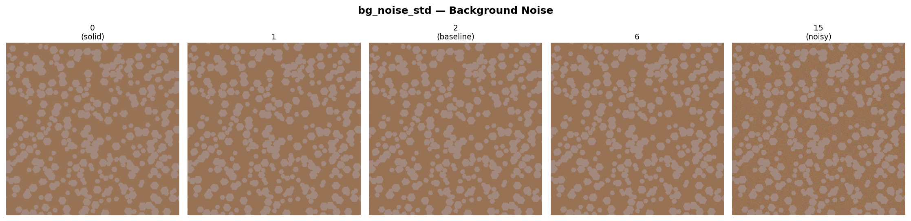

> **建议**: `1~6` 模拟典型显微镜背景噪声。

---

#### `color_mean` — 畴区颜色色调

每个畴区在此基础色上叠加 `color_std` 的随机偏移。

- **类型**: `tuple[int, int, int]`
- **默认值**: `(163, 138, 127)` — 暖棕色
- **取值范围**: `0~255` 每通道

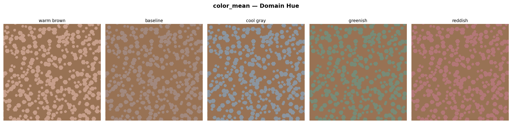

> **建议**: 根据目标显微镜图像的实际材料颜色设定。

---

#### `bg_mean` — 背景颜色色调

背景像素的基础色。

- **类型**: `tuple[int, int, int]`
- **默认值**: `(153, 115, 85)` — 比畴区略暗的棕色
- **取值范围**: `0~255` 每通道

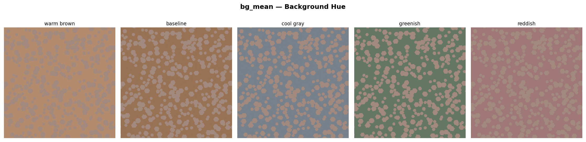

> **建议**: 通常背景比畴区略暗或偏不同色调以形成区分度。

---

### 3.2 几何与尺寸

#### `base_r_range` — 基础半径范围

未缩放时的畴区半径范围（像素）。最终半径 = `base_r × mag_factor × image_scale × supersample_ratio`。

- **类型**: `tuple[int, int]`
- **默认值**: `(15, 25)`
- **注意**: `image_scale=2` 时，10x (mag=1.0) 下实际半径为 30–50 px

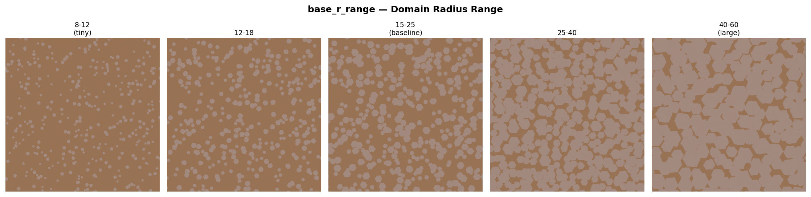

> **建议**: 配合 `mag_factor` 和 `image_scale` 达到目标视场的畴区尺寸。

---

#### `base_num_range` — 基础数量范围

未缩放时每张图像的畴区数量范围。最终数量 = `base_num / mag_factor²`。

- **类型**: `tuple[int, int]`
- **默认值**: `(200, 400)`
- **注意**: 该值在 mag=1.0 时生效（10x 参考倍率），低倍率下数量成倍增加

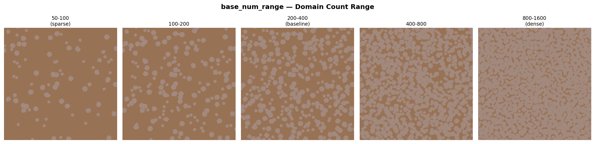

> **注意**: 实际放置数量受重叠控制器约束，极度密集的场景下可能无法放置全部目标数量。

---

#### `mag_factor` — 缩放倍率（联动数量）

**核心参数**。同时控制畴区大小和数量，模拟不同显微镜放大倍率：

- **半径 ∝ mag_factor**（线性缩放）
- **数量 ∝ 1/mag_factor²**（面积反比）

| mag_factor | 等效倍率 | 有效半径 | 有效数量 |
|------------|----------|----------|----------|
| 0.25 | 2.5× | 7–12 px | 3200–6400 |
| 0.5 | 5× | 15–25 px | 800–1600 |
| 1.0 | 10× | 30–50 px | 200–400 |
| 2.0 | 20× | 60–100 px | 50–100 |
| 5.0 | 50× | 150–250 px | 8–16 |
| 10.0 | 100× | 300–500 px | 2–4 |

- **类型**: `float`
- **默认值**: `1.0`
- **典型范围**: `0.2 ~ 10.0`

> 见 [第 2 节多倍率总览](#2-多倍率视场与畴区密度总览) 获取完整对比图。
> 使用 `gen_multi_mag.py` 可批量生成多倍率数据集。

---

#### `shape_jitter` — 顶点径向扰动

每个六边形顶点的半径叠加 `±shape_jitter × r` 的均匀随机扰动。0 = 正六边形。

- **类型**: `float`
- **默认值**: `0.1`
- **典型范围**: `0.0` (正六边形) ~ `0.35` (严重变形)

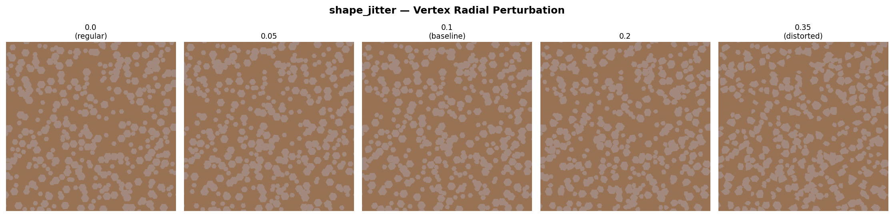

> **建议**: `0.05~0.15` 模拟天然晶粒的轻微不规则性。

---

#### `orientation_std` — 畴区取向分布

控制每个畴区六边形的随机旋转角度。值越大畴区间取向差异越大。

- **类型**: `float`
- **默认值**: `0`（所有畴区同向）
- **单位**: 度（°）
- **典型范围**: `0` (同向) ~ `60` (完全随机)
- **原理**: 每个畴区的起始角从 N(0, orientation_std°) 正态分布采样

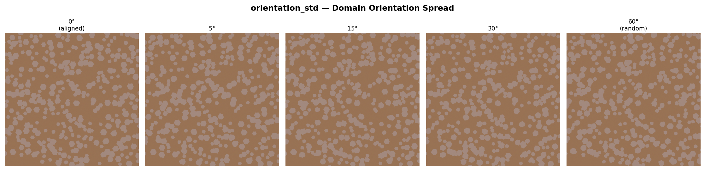

> **建议**: `0` 用于理想化对齐畴区；`5~15°` 模拟轻微取向偏差；`30~60°` 模拟多晶晶粒的随机取向。

---

#### `size_std` — 畴区大小分布

| 值 | 行为 |
|----|------|
| `None` | 均匀分布在 `[r_min, r_max]` 范围内 |
| 数值 | 正态分布，均值 = `(r_min+r_max)/2`，标准差 = `size_std` |

- **类型**: `float` or `None`
- **默认值**: `25`

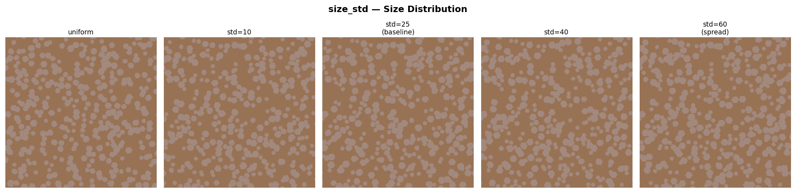

> **建议**: 天然畴区通常呈正态分布，`size_std=15~30` 较真实。

---

#### `image_scale` — 画布缩放因子

在不改变生成逻辑的前提下等比例缩放半径，用于适配不同画布尺寸。

- **类型**: `float`
- **默认值**: `2`
- **公式**: `image_scale = new_W / ref_W`（参考宽度 = 1024）
- **效果**: 仅影响半径，不影响数量

---

### 3.3 边缘毛刺

#### `edge_burr_amplitude` — 边缘粗糙度振幅

模拟晶体生长过程中的边缘粗糙度。沿法向施加随机游走扰动。

- **类型**: `float`
- **默认值**: `0.08`
- **典型范围**: `0.0` (光滑) ~ `0.18` (粗糙)

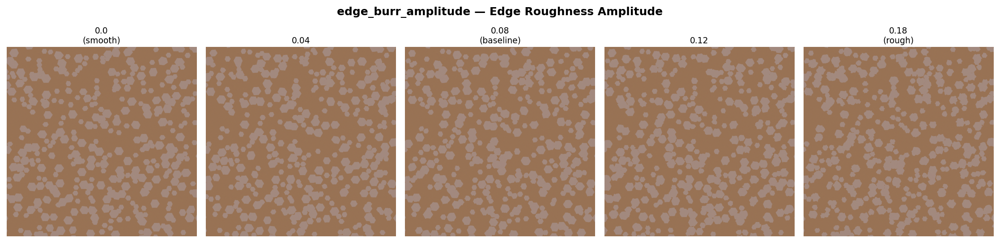

---

#### `edge_burr_subdivisions` — 边缘细分密度

每条边被细分为多少段。值越大毛刺越细密；`≤1` 时完全禁用。

- **类型**: `int`
- **默认值**: `4`
- **典型范围**: `2 ~ 12`

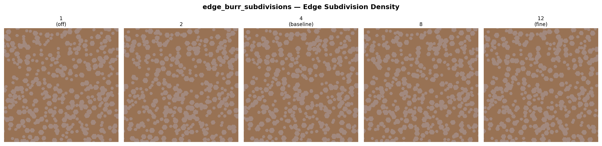

> **联合调参**: 当前默认 `amplitude=0.08, subdivisions=4` 产生自然的晶粒边缘。

---

### 3.4 重叠控制

#### `max_overlap_ratio` — 最大重叠比例

新畴区与已有畴区的交叠面积占自身面积的最大允许比例。

- **类型**: `float`
- **默认值**: `0.3`
- **范围**: `[0, 1]`

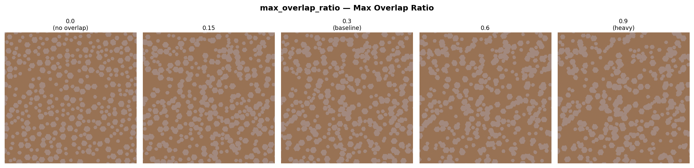

---

#### `max_overlap_count` — 最大像素覆盖层数

任一像素最多允许被多少个畴区覆盖。

- **类型**: `int` or `None`
- **默认值**: `3`

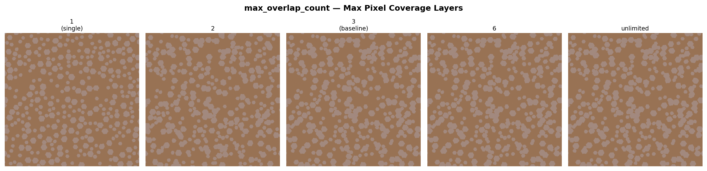

---

#### `contain_threshold` — 包含判定阈值

若新畴区覆盖某旧畴区超该比例，视为"包含"并拒绝放置。

- **类型**: `float`
- **默认值**: `0.85`

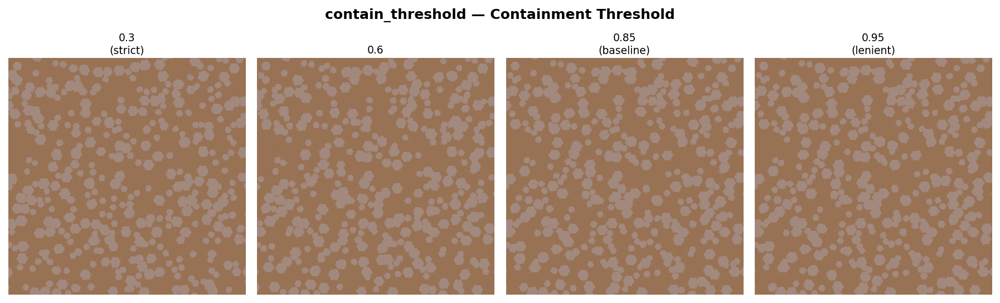

---

#### `min_area_factor` — 最小有效面积因子

实际最小面积 = `min_area_factor × supersample_ratio`（像素）。

- **类型**: `float`
- **默认值**: `5`

---

### 3.5 渲染

#### `supersample_ratio` — 超采样抗锯齿

内部以 `N×` 尺寸渲染后 Lanczos 降采样到目标尺寸。

- **类型**: `int`
- **默认值**: `1`
- **典型值**: `1` (无抗锯齿), `2`, `4` (高质量)

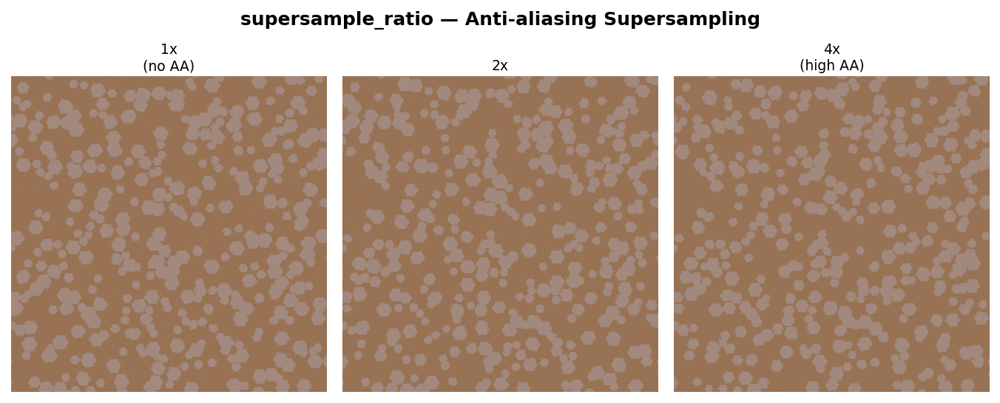

> **性能提示**: 超采样时间 ∝ N²。`N=2` 时渲染像素为 4×。

---

## 4. 增强器参数 — MicroscopyAugment

增强器在生成器之后施加，模拟显微镜成像系统的各种退化效果。每个增强项都有独立的**触发概率**参数。

### 参数总览

| 参数组 | 字段 | 类型 | gen_multi_mag 默认值 | 含义 |
|--------|------|------|---------------------|------|
| 亮度 | `brightness_range` | tuple | `(0.8, 1)` | 亮度因子范围 |
| | `brightness_prob` | float | `0.8` | 触发概率 |
| 对比度 | `contrast_range` | tuple | `(0.4, 1)` | 对比度因子范围 |
| | `contrast_prob` | float | `0.8` | 触发概率 |
| Gamma | `gamma_range` | tuple/None | `(0.7, 1.3)` | Gamma 值范围 |
| | `gamma_prob` | float | `0.8` | 触发概率 |
| 模糊 | `blur_range` | tuple | `(0.5, 1)` | 高斯模糊半径范围 |
| | `blur_prob` | float | `1.0` | 触发概率 |
| 椒盐噪声 | `sp_noise_prob` | float | `0.0` | 触发概率（关闭） |
| | `sp_noise_amount` | float | `0.005` | 噪声比例 |
| | `sp_noise_salt_ratio` | float | `0.5` | 白点占比 |
| 色温偏移 | `color_jitter_range` | tuple/None | `(-12, 12)` | RGB 偏移范围 |
| | `color_jitter_prob` | float | `0.8` | 触发概率 |
| 旋转 | `rotate_prob` | float | `0.0` | 旋转概率（关闭） |
| | `rotate_range` | tuple | `(-180,180)` | 旋转角度范围 |

---

### 4.1 Brightness — 亮度调整

通过 `TF.adjust_brightness()` 调整图像亮度。

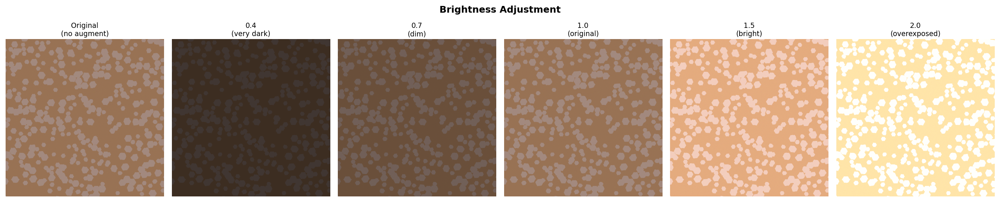

---

### 4.2 Contrast — 对比度调整

通过 `TF.adjust_contrast()` 调整对比度。`gen_multi_mag.py` 中默认 `(0.4, 1)`，仅向低对比度方向变化。

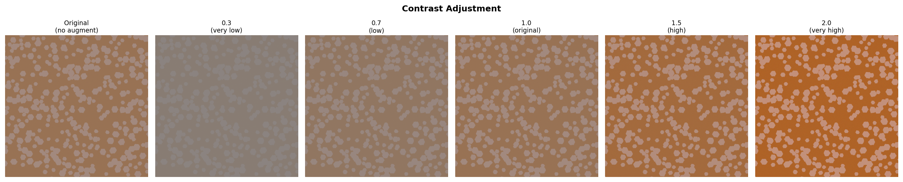

---

### 4.3 Gamma — Gamma 校正

通过 `TF.adjust_gamma()` 非线性亮度映射。`<1` 提亮暗部，`>1` 压暗暗部。

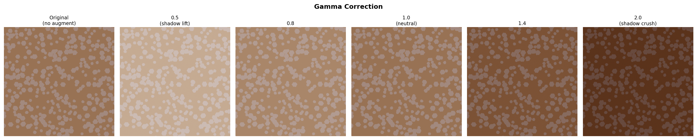

---

### 4.4 Gaussian Blur — 高斯模糊

通过 `PIL.ImageFilter.GaussianBlur()` 模拟显微镜失焦或光学衍射。

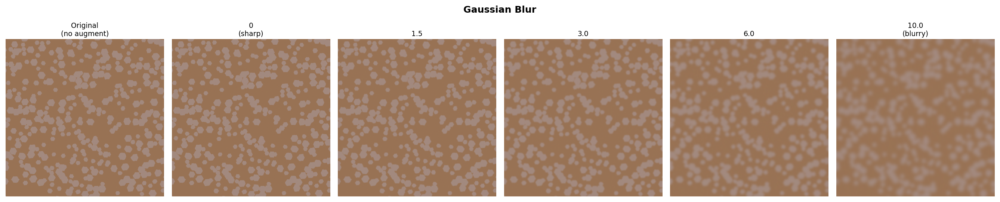

---

### 4.5 Salt & Pepper Noise — 椒盐噪声

随机将部分像素置为纯白或纯黑，模拟传感器坏点或脉冲噪声。
`gen_multi_mag.py` 中默认关闭 (`sp_noise_prob=0`)。

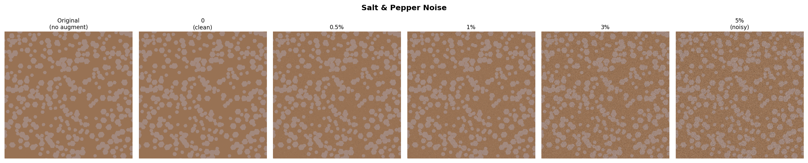

---

### 4.6 Color Jitter — 色温/光源偏移

在每个 RGB 通道上施加全局偏移，模拟不同光源色温或白平衡偏差。
**在所有其他增强之前施加**。`gen_multi_mag.py` 中默认启用 `(-12, 12)`。

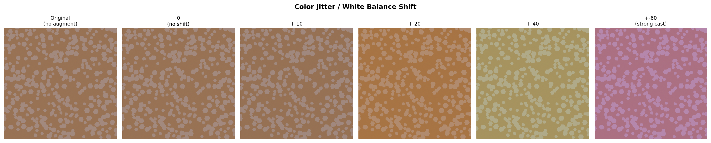

---

### 4.7 Rotation — 图像旋转

随机旋转整张图像。`gen_multi_mag.py` 中默认关闭 (`rotate_prob=0.0`)。

> **注意**: 旋转后多边形坐标会跟随旋转，与图像边界相交时需 `refine_polygons()` 处理。

---

## 5. 参数交互关系

### 5.1 半径和数量的联合缩放（核心公式）

```
有效半径 = base_r × mag_factor × image_scale × supersample_ratio
有效数量 = base_num / mag_factor²
```

- 增大 `mag_factor` → 畴区变大、数量减少（**近景效应**）
- 减小 `mag_factor` → 畴区变小、数量增加（**远景效应**）
- 改变 `image_scale` → 仅影响半径，**不影响数量**

### 5.2 重叠参数协同

| 场景 | max_overlap_ratio | max_overlap_count | contain_threshold |
|------|-------------------|-------------------|-------------------|
| 完全分离 | 0.0 | 1 | 0.5 |
| 轻微接触 | 0.15~0.25 | 2 | 0.85 |
| 适度重叠（默认） | 0.3 | 3 | 0.85 |
| 重度重叠 | 0.6+ | None | 0.95 |

### 5.3 边缘毛刺 + 形状扰动

`shape_jitter` 改变六边形的整体形状，`edge_burr_*` 在每条边上叠加高频细节：

```python
# 当前默认值（gen_multi_mag 配置）
HexagonGenerator(
    shape_jitter=0.1,            # 轻微不规则形状
    edge_burr_amplitude=0.08,    # 明显边缘粗糙
    edge_burr_subdivisions=4,    # 中等细分密度
)
```

---

## 6. 调参工作流建议

### 6.1 从真实图像出发

1. **确定倍率**: 根据目标显微镜放大倍率，从 MAG_FACTORS 中选择 `mag_factor`
2. **匹配颜色**: 从真实图像采样畴区和背景的平均 RGB，设为 `color_mean` / `bg_mean`
3. **估计尺寸**: 测量真实畴区直径（像素），反推 `base_r_range`（注意 `image_scale` 的缩放）
4. **估计数量**: 统计真实畴区数量，反推 `base_num_range`（注意 `mag_factor²` 的反比缩放）
5. **微调纹理**: 调整 `texture_std`、`bg_noise_std`、`edge_burr_amplitude` 使纹理接近真实

### 6.2 控制变量调参

```bash
# 快速浏览所有参数效果（256×256，约 30 秒）
python -m om_domain.param_showcase --size 256

# 高质量展示（512×512）
python -m om_domain.param_showcase --size 512 --seed 42

# 仅看多倍率总览
python -m om_domain.param_showcase --multi-mag-only

# 仅看生成器参数
python -m om_domain.param_showcase --gen-only

# 仅看增强器参数
python -m om_domain.param_showcase --aug-only
```

### 6.3 批量生成前验证

```python
from om_domain.pipeline import DatasetPipeline
from om_domain.hexagon_generator import HexagonGenerator

gen = HexagonGenerator(
    mag_factor=0.5,
    color_std=0.2,
    # ... 你的其余参数
)
pipeline = DatasetPipeline(gen, augmenter=None)  # 先不增强
pipeline.run("./output/test", n=5, image_size=(1024, 800))
# 人工检查 output/test/image/ 中的图像，确认参数合适后再批量生成
```

---

## 7. 运行展示脚本

### 快速开始

```bash
# 生成所有对比图（多倍率总览 + 生成器 + 增强器）
python -m om_domain.param_showcase

# 指定输出目录和图像尺寸
python -m om_domain.param_showcase --output ./my_showcase --size 512
```

### 输出结构

```
output/param_showcase/
├── index.md                              ← Markdown 索引（含所有图片）
├── multi_mag_overview.png                ← 多倍率视场与畴区密度总览
├── gen_color_std_*.png                   ← 15 张生成器参数对比图
├── gen_texture_std_*.png
├── ...
├── aug_Brightness_Adjustment.png         ← 6 张增强器参数对比图
└── ...
```

### 依赖

- `numpy`, `PIL` (Pillow)
- `matplotlib`
- `torchvision` (MicroscopyAugment 依赖)

---

## 附录 A: 基准配置 (与 gen_multi_mag.py 一致)

```python
# param_showcase.py 的 BASELINE_CONFIG == gen_multi_mag.py 的 SHARED_GEN_KWARGS
BASELINE_CONFIG = dict(
    # -- 颜色 / 纹理 --
    color_mean=(163, 138, 127),
    bg_mean=(153, 115, 85),
    color_std=0.2,               # 固定，畴区间几乎同色
    texture_std=2,
    bg_noise_std=2,
    # -- 几何 / 尺寸 --
    base_r_range=(15, 25),
    base_num_range=(200, 400),
    size_std=25,
    mag_factor=1.0,
    shape_jitter=0.1,
    orientation_std=0,
    image_scale=2,
    # -- 边缘毛刺 --
    edge_burr_amplitude=0.08,
    edge_burr_subdivisions=4,
    # -- 重叠控制 --
    max_overlap_ratio=0.3,
    max_overlap_count=3,
    contain_threshold=0.85,
    min_area_factor=5,
    # -- 渲染 --
    supersample_ratio=1,
)
```

## 附录 B: 增强器配置 (与 gen_multi_mag.py 一致)

```python
# gen_multi_mag.py 的 SHARED_AUG_KWARGS
MicroscopyAugment(
    brightness_range=(0.8, 1),           # 仅向暗调变化
    brightness_prob=0.8,
    contrast_range=(0.4, 1),             # 仅向低对比度变化
    contrast_prob=0.8,
    gamma_range=(0.7, 1.3),
    gamma_prob=0.8,
    blur_range=(0.5, 1),
    blur_prob=1.0,
    color_jitter_range=(-12, 12),
    color_jitter_prob=0.8,
    sp_noise_prob=0.0,                   # 关闭
    rotate_prob=0.0,                     # 关闭
)
```

## 附录 C: 倍率参数速查

| 倍率 | mag_factor | 有效半径 (px) | 有效数量 | 典型用途 |
|------|------------|---------------|----------|----------|
| 2.5× | 0.25 | 7–12 | 3200–6400 | 低倍全景，统计分布 |
| 5× | 0.5 | 15–25 | 800–1600 | 中低倍，畴区计数 |
| 10× | 1.0 | 30–50 | 200–400 | 参考倍率 |
| 20× | 2.0 | 60–100 | 50–100 | 高倍，形态学分析 |
| 50× | 5.0 | 150–250 | 8–16 | 单个畴区细节 |
| 100× | 10.0 | 300–500 | 2–4 | 特写，边界分析 |

> 基准参数: `base_r_range=(15,25)`, `base_num_range=(200,400)`, `image_scale=2`, `supersample_ratio=1`
