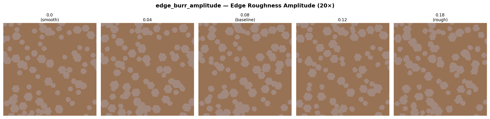
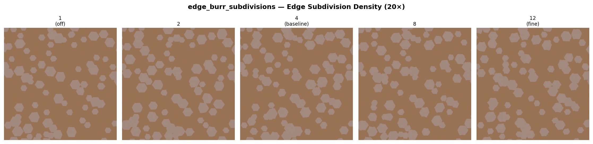
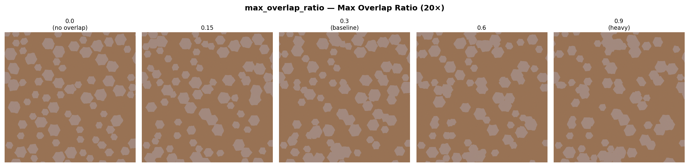
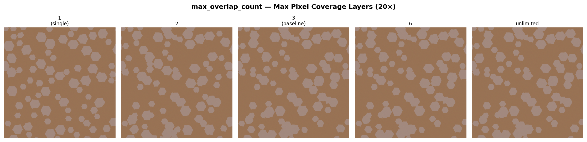
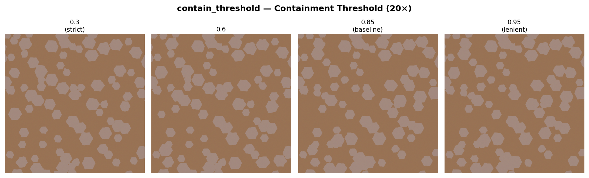

# 参数效果展示 — 索引 (color_std=0.2)

- **随机种子**: `42`
- **图像尺寸**: `1024×1024`
- **基准参数**: 与 `gen_multi_mag.py` 的 `SHARED_GEN_KWARGS` 一致
- **color_std**: 固定为 `0.2`
- 每张图保持其他参数不变，仅改变目标参数（控制变量法）

---

## 生成器参数 (color_std=0.2)

### color_std — Inter-domain Color Variation

### texture_std — Intra-domain Texture Noise

### bg_noise_std — Background Noise

### color_mean — Domain Hue

### bg_mean — Background Hue

### base_r_range — Domain Radius Range

### shape_jitter — Vertex Radial Perturbation

### orientation_std — Domain Orientation Spread

### size_std — Size Distribution

### base_num_range — Domain Count Range

### edge_burr_amplitude — Edge Roughness Amplitude (20×)

### edge_burr_subdivisions — Edge Subdivision Density (20×)

### max_overlap_ratio — Max Overlap Ratio (20×)

### max_overlap_count — Max Pixel Coverage Layers (20×)

### contain_threshold — Containment Threshold (20×)

### supersample_ratio — Anti-aliasing Supersampling

